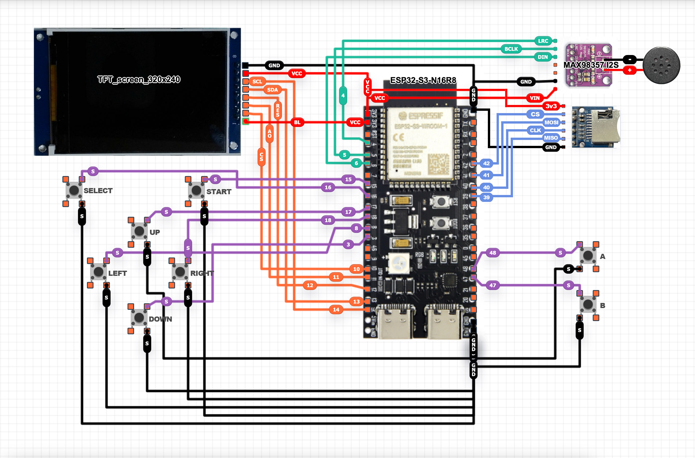
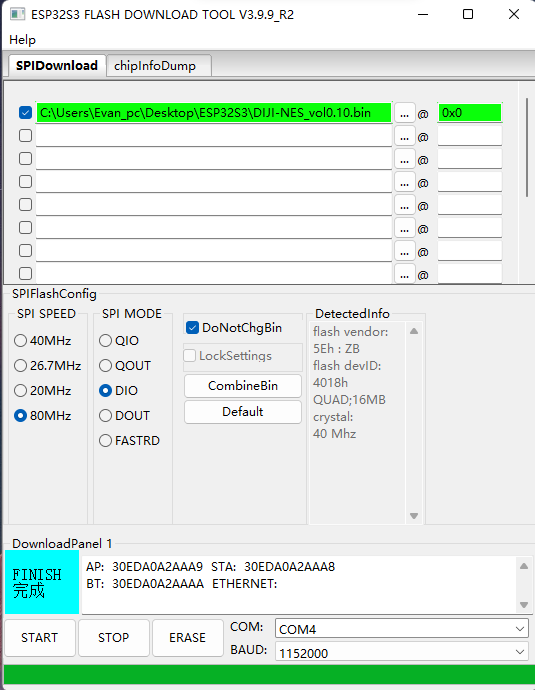

# DIJI-NES

<p align="center">
  
  
  
</p>

> ⚠️ **学习项目 / Learning Project**
> 
> 这是一个用于学习 NES 模拟器原理和嵌入式系统编程的项目。部分功能仍在开发中。
> 
> This is a learning project for understanding NES emulation and embedded systems programming. Some features are still under development.

<p align="center">
   
</p>

---

ESP32-S3 上运行的 NES（任天堂红白机）模拟器，支持显示、音频和控制器。

A NES (Nintendo Entertainment System) emulator running on ESP32-S3 microcontroller with display, audio, and controller support.

---

## ✨ 功能特性 / Features

- **完整 CPU 模拟** - 6502 CPU 全指令集 (~150 操作码)
- **PPU 图形** - 背景渲染、滚动、分屏效果、64 个精灵 (8×8 和 8×16 模式)
- **APU 音频** - 方波、三角波、噪声、DMC 通道，通过 I2S DAC 输出
- **双核架构** - Core 0: 音频 + 显示, Core 1: 模拟
- **60 FPS** - 大部分游戏稳定 60 FPS
- **Mapper 支持** - NROM, MMC1, UxROM, CNROM, MMC3
- **存档功能** - 快速存档/读档到 SD 卡
- **菜单系统** - ROM 浏览器、暂停菜单、无 SD 卡时提示界面

---

## 🎮 兼容性 / Compatibility

| Mapper | 名称   | 状态     |
|--------|--------|----------|
| 0      | NROM   | ✅ 正常   |
| 1      | MMC1   | ✅ 正常   |
| 2      | UxROM  | ✅ 正常   |
| 3      | CNROM  | ✅ 正常   |
| 4      | MMC3   | ✅ 正常   |


### Project Status / 项目状态

本项目已支持 **NES 前期、中期及大部分后期游戏**，包括依赖 MMC3 扫描线 IRQ 的游戏（如超级马里奥 3）。

少数非标准时序或特殊 mapper 的游戏可能仍有兼容性问题。

This emulator now supports **early-, mid-, and most late-era NES titles**, including games that rely on **MMC3 scanline IRQ timing** (e.g., Super Mario Bros. 3).

A small number of games with non-standard timing or special mappers may still have compatibility issues.

---

## 📊 性能 / Performance

| 指标       | 数值          |
|------------|---------------|
| 模拟 FPS   | 60 FPS (稳定) |
| 音频采样率 | 44100 Hz      |
| Flash 使用 | ~486 KB (7%)  |
| RAM 使用   | ~51 KB (16%)  |

---

## 🛠️ 硬件需求 / Hardware

| 组件       | 规格                                              |
|------------|---------------------------------------------------|
| **MCU**    | ESP32-S3-N16R8 (双核 240MHz, 16MB Flash, 8MB PSRAM) |
| **显示屏** | ST7789 TFT LCD 320×240 (SPI)                       |
| **音频 DAC** | MAX98357A I2S DAC                                 |
| **存储**   | SD 卡 (FAT32, 存放 ROM 文件)                       |
| **输入**   | 8 个按键 (直连 GPIO)                              |

---

<p align="center">
   
</p>

## 📌 引脚配置 / Pin Configuration

### SD 卡
| 功能   | GPIO |
|--------|------|
| CS     | 42   |
| SCLK   | 40   |
| MISO   | 39   |
| MOSI   | 41   |

### 控制器按键
| 按键   | GPIO |
|--------|------|
| A      | 48   |
| B      | 47   |
| SELECT | 16   |
| START  | 15   |
| UP     | 17   |
| DOWN   | 3    |
| LEFT   | 8    |
| RIGHT  | 18   |

### I2S 音频
| 功能   | GPIO |
|--------|------|
| BCLK   | 5    |
| LRC    | 4    |
| DOUT   | 6    |

### TFT 显示屏
详见 [lgfx_conf.h](src/lgfx_conf.h) (LovyanGFX 配置)。

⚠️ 注意 / Note
部分 TFT 显示屏需要在该文件中启用 颜色反转（invert） 设置，否则可能出现 颜色反了、发白或对比度异常 的情况。
如遇此问题，请在 lgfx_conf.h 中尝试修改：cfg.invert = true;

Some TFT displays require color inversion (invert) to be enabled in this file.
Otherwise, issues such as inverted colors, washed-out colors, or incorrect contrast may occur.
If you encounter these problems, try modifying the following setting in lgfx_conf.h: cfg.invert = true;


---

## 🚀 Build & Upload / 编译与上传
### Prerequisites / 前置条件

- **VS Code**
- **PlatformIO**（VS Code 扩展）
  https://platformio.org/install/ide?install=vscode
- ESP32-S3 USB 驱动（大多数系统会自动安装）

> > ⚠️ **无需手动安装第三方库**  
> 本项目使用 PlatformIO 管理依赖。所有所需库（包括 **LovyanGFX**）将在首次编译时由 PlatformIO 自动下载。
>
> ⚠️ **No manual third-party library installation required**  
> This project uses PlatformIO for dependency management. All required libraries (including **LovyanGFX**) will be automatically downloaded by PlatformIO during the first build.

---

### 固件文件 / Prebuilt Firmware

为方便直接烧录，仓库根目录提供了预编译合并固件：

- [firmware/DIJI-NES_v0.2.1.bin](firmware/DIJI-NES_v0.2.1.bin)

该文件已合并 **bootloader + partitions + boot_app0 + app firmware**，可直接按地址 **0x0** 烧录。

For convenience, a prebuilt merged firmware image is included in the repository root:

- [firmware/DIJI-NES_v0.2.1.bin](firmware/DIJI-NES_v0.2.1.bin)

This image already contains the **bootloader + partitions + boot_app0 + application firmware**, so it can be flashed directly to address **0x0**.

---

### Option 1: Using PlatformIO (Recommended)  
### 方式一：使用 PlatformIO（推荐）

1. Open this project folder in **VS Code**  
   使用 **VS Code** 打开本项目目录

2. PlatformIO will automatically detect the project and install the required toolchain  
   PlatformIO 会自动识别项目并安装所需工具链

3. Select the correct serial port for your ESP32-S3 board  
   选择正确的 ESP32-S3 串口设备

4. Click **Upload** in PlatformIO to build and flash the firmware  
   点击 PlatformIO 的 **Upload** 按钮进行编译并烧录

---

### Option 2: Using Espressif Flash Download Tool  
### 方式二：使用乐鑫 Flash Download Tool 烧录

如果你希望直接烧录预编译固件，可使用乐鑫官方烧录工具：  
下载地址：<https://docs.espressif.com/projects/esp-test-tools/zh_CN/latest/esp32/production_stage/tools/flash_download_tool.html>

If you prefer flashing a prebuilt image directly, you can use Espressif's official Flash Download Tool:  
Download: <https://docs.espressif.com/projects/esp-test-tools/zh_CN/latest/esp32/production_stage/tools/flash_download_tool.html>

1. 启动工具后，将 **ChipType** 选择为 **ESP32S3**，其余选项保持默认。  
   After launching the tool, set **ChipType** to **ESP32S3** and leave the other options at their default values.

2. 参考下图勾选并配置烧录项：  
   Follow the example below to select and configure the flashing items:

   <p align="center">
     
   </p>

3. 选择仓库中的合并固件文件 [firmware/DIJI-NES_v0.2.1.bin](firmware/DIJI-NES_v0.2.1.bin)，烧录地址填写 **0x0**。  
   Select the merged firmware file [firmware/DIJI-NES_v0.2.1.bin](firmware/DIJI-NES_v0.2.1.bin) from this repository and set the flash address to **0x0**.

4. 确认设备串口连接正常后，点击 **START** 开始烧录。  
   After confirming the serial port is connected correctly, click **START** to begin flashing.

5. 烧录完成后重启设备，即可进入 DIJI-NES。  
   Reboot the device after flashing completes to start DIJI-NES.

---

### 🛠 常见问题排查 / Troubleshooting

**PlatformIO 卡在 “Resolving dependencies…”**

如果 PlatformIO 在配置项目或解析依赖时卡住，通常是由于 PlatformIO 本地环境损坏、缓存问题或权限异常导致的。
可按下列步骤排查：

- 备份并删除 PlatformIO 主目录（将触发依赖重下载）：

```bash
rm -rf ~/.platformio
```

- 检查并修复目录权限（如果删除失败或出现权限错误）：

```bash
sudo chown -R $(whoami) ~/.platformio
```

- 在终端中验证 PlatformIO 可用并更新元数据：

```bash
platformio update
platformio upgrade
```

- 重新启动 VS Code，必要时重新安装 PlatformIO 扩展。

如果问题仍然存在，参考 PlatformIO 官方文档或查看 VS Code 输出面板中的 PlatformIO 日志以获取详细错误信息。

**PlatformIO stuck at "Resolving dependencies..."**

If PlatformIO gets stuck while configuring the project or resolving dependencies, it is often caused by a corrupted cache, permission issues, or a broken local PlatformIO environment.
Try the steps below:

- Backup and remove the PlatformIO home directory (this forces re-downloading dependencies):

```bash
rm -rf ~/.platformio
```

- Fix ownership/permissions if deletion or access fails:

```bash
sudo chown -R $(whoami) ~/.platformio
```

- Update PlatformIO core and metadata:

```bash
platformio update
platformio upgrade
```

- Restart VS Code and, if needed, reinstall the PlatformIO extension.

If the issue persists, check the PlatformIO output/logs in VS Code for error details and consult the PlatformIO docs.

---

## 🎮 使用方法 / Usage

注意：本项目不包含、提供或分发任何游戏 ROM。所有 ROM 均为版权所有，属于各自权利人。
本项目仅供技术学习与研究使用。作者不对用户如何获取或使用 ROM 文件承担任何责任。

This project does NOT include, provide, or distribute any game ROMs. All ROMs are copyrighted and remain the property of their respective owners.
This project is intended solely for technical learning and research. The author assumes no responsibility for how users obtain or use ROM files.

1. **准备 ROM 文件**: 将 `.nes` ROM 文件复制到 SD 卡根目录
2. **插入 SD 卡**
3. **开机**: 设备会显示 ROM 浏览菜单
4. **选择游戏**: 
   - **上/下** 滚动列表
   - **START** 或 **A** 启动游戏
5. **游戏内控制**:
   - **START + SELECT**: 打开暂停菜单（可返回 ROM 浏览器）

---

## 📁 项目结构 / Project Structure

```
DiJi-NES/
├── firmware/
│   └── DIJI-NES_v0.2.1.bin # 预编译合并固件，可直接烧录到 0x0
├── src/
│   ├── main.cpp        # 入口、硬件初始化、主循环
│   ├── nes.h/.cpp      # NES 系统总线、内存映射
│   ├── cpu6502.h/.cpp  # 6502 CPU 模拟
│   ├── ppu.h/.cpp      # PPU 图形处理器
│   ├── apu.h/.cpp      # APU 音频处理器
│   ├── cartridge.h/.cpp # ROM 加载、Mapper 实现
│   └── lgfx_conf.h     # LovyanGFX 显示配置
├── platformio.ini      # PlatformIO 配置
└── Makefile            # 快捷编译命令
```

---

## 🙏 致谢 / Acknowledgments

本项目参考了以下项目的实现方式：

- [Anemoia-ESP32](https://github.com/Shim06/Anemoia-ESP32) - APU 时钟同步策略、帧级调度设计
- [LovyanGFX](https://github.com/lovyan03/LovyanGFX) - 显示库
- [NESdev Wiki](https://www.nesdev.org/wiki/) - NES 硬件文档

特别感谢 Anemoia-ESP32 项目，本项目的 帧级调度设计 和 APU 独立核心运行 + I2S 阻塞同步的设计思路来源于此。

---

## 📄 许可证 / License

本项目使用 **GNU General Public License v3.0** (GPLv3) 许可证。

详见 [LICENSE](LICENSE)。

---

## 🔮 已知问题 / Known Issues

- 某些使用非标准时序的游戏可能有图形问题
- 盗版 ROM 的脏 iNES 头可能导致 mapper 识别错误（已加入自动检测）

---

<p align="center">
  <b>Happy Gaming! 🎮</b>
</p>


